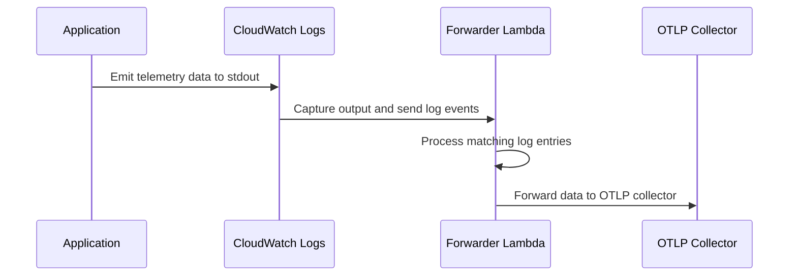

# Architecture

The Lambda OTLP Forwarder uses a unique architecture that leverages AWS CloudWatch Logs as a transport layer for telemetry data. This approach provides several benefits over traditional sidecar-based solutions.

## Components

### 1. Application Instrumentation
Language-specific libraries format telemetry data and write to stdout/CloudWatch Logs:
- Integrates with OpenTelemetry SDKs
- Captures traces, metrics, and logs in OTLP format
- Serializes and optionally compresses telemetry data
- Writes formatted data to stdout

### 2. CloudWatch Logs
Transport layer for telemetry data:
- Automatically captures stdout/stderr from Lambda functions
- Provides durable storage and routing
- Enables subscription filters
- Handles log retention and encryption

### 3. Forwarder Lambda
Processes and forwards data to collectors:
- Receives log events via CloudWatch Logs subscription
- Decompresses and deserializes OTLP data
- Routes telemetry to appropriate collectors
- Handles authentication and retries
- Provides buffering and batching

### 4. OTLP Collector
Your chosen observability platform:
- Receives OTLP data over HTTP/HTTPS
- Provides advanced sampling and filtering
- Supports multiple backend destinations
- Handles data aggregation and processing

## Data Flow

1. Your application emits telemetry data to stdout
2. CloudWatch Logs captures the output
3. Forwarder Lambda processes matching log entries
4. Data is forwarded to your OTLP collector

## Benefits

- **Reduced Cold Start**: No sidecar initialization
- **Cost Effective**: Minimal resource overhead
- **Secure**: Data stays within AWS infrastructure
- **Flexible**: Support for multiple languages and collectors
- **Reliable**: Durable transport via CloudWatch Logs 