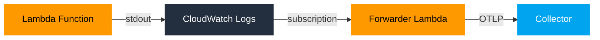
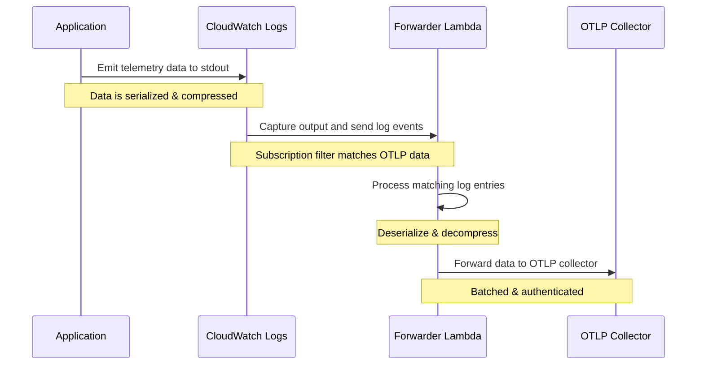

# Architecture
{: .fs-9 }

Understanding how Lambda OTLP Forwarder works.
{: .fs-6 .fw-300 }

{: .info }
The Lambda OTLP Forwarder uses a unique architecture that leverages AWS CloudWatch Logs as a transport layer for telemetry data, providing several benefits over traditional sidecar-based solutions.

## System Overview
{: .text-delta }

## Components
{: .text-delta }

### 1. Application Instrumentation
{: .text-delta }

Language-specific libraries format telemetry data and write to stdout/CloudWatch Logs:

{: .highlight }
> - Integrates with OpenTelemetry SDKs
> - Captures traces, metrics, and logs in OTLP format
> - Serializes and optionally compresses telemetry data
> - Writes formatted data to stdout

### 2. CloudWatch Logs
{: .text-delta }

Transport layer for telemetry data:

{: .highlight }
> - Automatically captures stdout/stderr from Lambda functions
> - Provides durable storage and routing
> - Enables subscription filters
> - Handles log retention and encryption

### 3. Forwarder Lambda
{: .text-delta }

Processes and forwards data to collectors:

{: .highlight }
> - Receives log events via CloudWatch Logs subscription
> - Decompresses and deserializes OTLP data
> - Routes telemetry to appropriate collectors
> - Handles authentication and retries
> - Provides buffering and batching

### 4. OTLP Collector
{: .text-delta }

Your chosen observability platform:

{: .highlight }
> - Receives OTLP data over HTTP/HTTPS
> - Provides advanced sampling and filtering
> - Supports multiple backend destinations
> - Handles data aggregation and processing

## Data Flow
{: .text-delta }

## Benefits
{: .text-delta }

{: .success }
**Reduced Cold Start**
No sidecar initialization means faster function startup

{: .success }
**Cost Effective**
Minimal resource overhead and efficient data transport

{: .success }
**Secure**
Data stays within AWS infrastructure with proper IAM controls

{: .success }
**Flexible**
Support for multiple languages and collectors

{: .success }
**Reliable**
Durable transport via CloudWatch Logs with retry capabilities

## Best Practices
{: .text-delta }

### Data Format
{: .text-delta }

{: .info }
- Use protobuf for better performance
- Enable compression for large payloads
- Consider payload size limits

### Processing
{: .text-delta }

{: .info }
- Configure appropriate batch sizes
- Set reasonable timeouts
- Monitor processing errors

### Resource Usage
{: .text-delta }

{: .info }
- Monitor Lambda memory usage
- Watch CloudWatch Logs costs
- Configure appropriate concurrency

### Error Handling
{: .text-delta }

{: .info }
- Implement retry strategies
- Set up error alerting
- Monitor failed deliveries

## Next Steps
{: .text-delta }

- [Configure Processors](../concepts/processors)
- [Set up Monitoring](../deployment/monitoring)
- [Performance Tuning](../advanced/performance) 