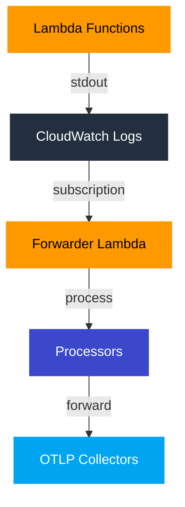
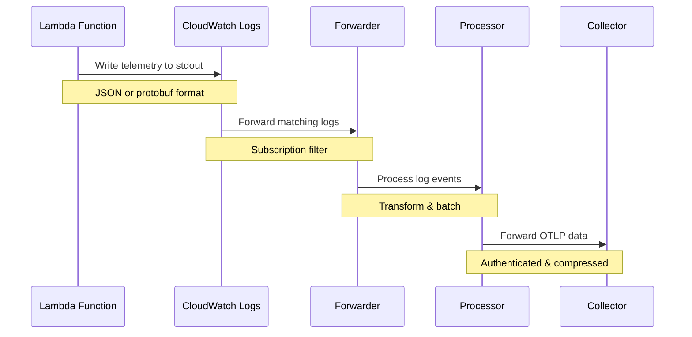

# Core Concepts
{: .fs-9 }

Understanding the fundamental concepts and architecture of Lambda OTLP Forwarder.
{: .fs-6 .fw-300 }

## Overview
{: .text-delta }

The Lambda OTLP Forwarder is built on several key concepts that work together to provide efficient telemetry data forwarding:

{: .highlight }
**Key Components**
- Instrumented Lambda functions
- CloudWatch Logs transport
- Forwarder Lambda function
- OTLP collectors
- Processors and transformers

## Architecture Overview
{: .text-delta }

## Key Topics
{: .text-delta }

### [Architecture](architecture)
{: .text-delta }

{: .info }
Learn about:
- System components
- Data flow
- Integration points
- Scalability design
- Security model

### [Processors](processors)
{: .text-delta }

{: .info }
Understand:
- Processor types
- Data transformation
- Buffering and batching
- Error handling
- Configuration options

## Core Principles
{: .text-delta }

### 1. Efficiency
{: .text-delta }

{: .highlight }
- Minimal cold start impact
- Efficient data transport
- Optimized resource usage
- Smart batching
- Compression support

### 2. Reliability
{: .text-delta }

{: .highlight }
- Durable message delivery
- Automatic retries
- Error handling
- Dead letter queues
- Monitoring and alerts

### 3. Security
{: .text-delta }

{: .highlight }
- IAM role-based access
- Encryption in transit
- Secure credential storage
- Network isolation
- Audit logging

### 4. Scalability
{: .text-delta }

{: .highlight }
- Automatic scaling
- Concurrent processing
- Load balancing
- Resource optimization
- Cost efficiency

## Data Flow
{: .text-delta }

## Integration Points
{: .text-delta }

### AWS Services
{: .text-delta }

{: .info }
- AWS Lambda
- CloudWatch Logs
- IAM
- Secrets Manager
- X-Ray
- CloudWatch Metrics

### External Systems
{: .text-delta }

{: .info }
- OTLP Collectors
- Observability Platforms
- Monitoring Systems
- Alert Managers
- Visualization Tools

## Best Practices
{: .text-delta }

### Design Principles
{: .text-delta }

{: .warning }
Follow these guidelines:
- Keep functions focused
- Use appropriate batch sizes
- Enable compression
- Implement proper error handling
- Monitor and alert

### Resource Management
{: .text-delta }

{: .warning }
Optimize resources:
- Configure memory appropriately
- Set proper timeouts
- Use efficient protocols
- Enable batching
- Monitor costs

## Next Steps
{: .text-delta }

- [Understand the Architecture](architecture)
- [Learn about Processors](processors)
- [Configure Deployment](../deployment)
- [Explore Advanced Features](../advanced) 