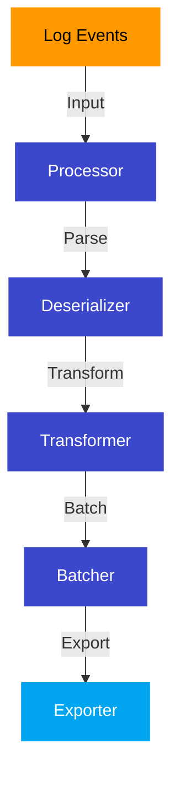
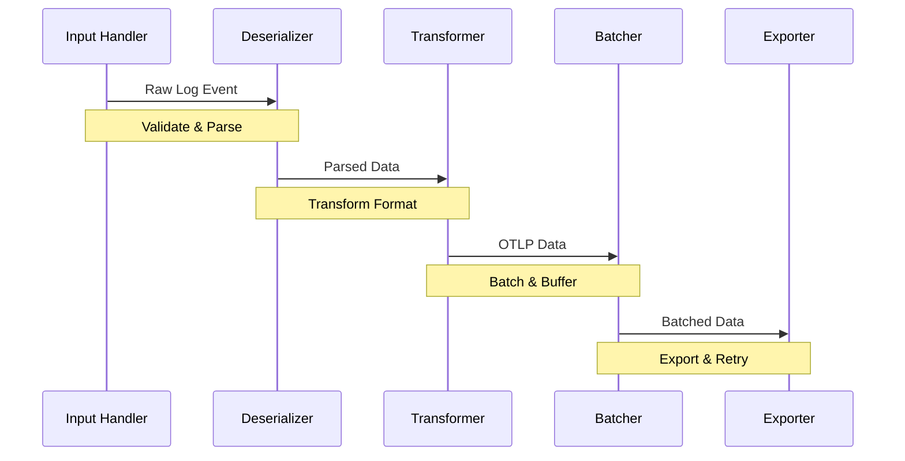

# Processors
{: .fs-9 }

Understanding the processor architecture and configuration options in Lambda OTLP Forwarder.
{: .fs-6 .fw-300 }

## Overview
{: .text-delta }

Processors are the core components that handle telemetry data transformation and forwarding:



## Available Processors
{: .text-delta }

### OTLP Stdout Processor
{: .text-delta }

{: .highlight }
The standard processor for handling OTLP data from CloudWatch Logs:
- Supports JSON and protobuf formats
- Handles GZIP compression
- Configurable batching
- Multiple collector support
- Custom authentication

```yaml
ProcessorType: otlp-stdout
Configuration:
  Format: protobuf
  Compression: gzip
  BatchSize: 100
  FlushInterval: 5
```

### AWS Application Signals
{: .text-delta }

{: .highlight }
Native integration with AWS observability services:
- X-Ray tracing
- CloudWatch metrics
- Log correlation
- Automatic context
- Resource detection

```yaml
ProcessorType: aws-appsignals
Configuration:
  XRayEnabled: true
  MetricsEnabled: true
  LogCorrelation: true
  SamplingRate: 0.1
```

## Processor Architecture
{: .text-delta }

### Component Pipeline
{: .text-delta }



### Data Flow Stages
{: .text-delta }

{: .info }
1. **Input Handling**
   - Log event validation
   - Format detection
   - Initial filtering
   - Error checking

{: .info }
2. **Deserialization**
   - JSON parsing
   - Protobuf decoding
   - Compression handling
   - Schema validation

{: .info }
3. **Transformation**
   - Format conversion
   - Data enrichment
   - Field mapping
   - Context propagation

{: .info }
4. **Batching**
   - Buffer management
   - Size control
   - Time windows
   - Memory limits

{: .info }
5. **Export**
   - Collector routing
   - Authentication
   - Retry handling
   - Error reporting

## Configuration Options
{: .text-delta }

### Common Settings
{: .text-delta }

| Setting | Description | Default | Options |
|:--------|:------------|:--------|:---------|
| `Format` | Data format | `protobuf` | `protobuf`, `json` |
| `Compression` | Compression type | `gzip` | `gzip`, `none` |
| `BatchSize` | Items per batch | `100` | `1` to `1000` |
| `FlushInterval` | Seconds between flushes | `5` | `1` to `60` |
| `RetryCount` | Maximum retries | `3` | `0` to `10` |
| `Timeout` | Operation timeout (s) | `30` | `1` to `300` |

### Advanced Options
{: .text-delta }

```yaml
AdvancedConfig:
  Memory:
    MaxBufferSize: 104857600  # 100MB
    GCThreshold: 0.8
    EmergencyFlush: 0.95

  Retry:
    InitialInterval: 1
    MaxInterval: 30
    Multiplier: 2
    RandomizationFactor: 0.2

  Monitoring:
    MetricsEnabled: true
    HealthCheckInterval: 60
    AlertingEnabled: true
```

## Performance Tuning
{: .text-delta }

### Batch Processing
{: .text-delta }

{: .warning }
Optimize batching for your use case:
- Larger batches → Better throughput
- Smaller batches → Lower latency
- Consider memory usage
- Monitor performance
- Handle backpressure

```yaml
BatchConfig:
  Size: 100
  TimeoutSeconds: 5
  MaxBytes: 1048576
  MaxConcurrent: 5
```

### Memory Management
{: .text-delta }

{: .warning }
Memory optimization guidelines:
- Monitor buffer usage
- Set appropriate limits
- Configure GC thresholds
- Handle overflow
- Implement backpressure

```yaml
MemoryConfig:
  MaxBufferMB: 100
  GCThresholdPercent: 80
  EmergencyFlushPercent: 95
  MonitoringIntervalSeconds: 60
```

## Error Handling
{: .text-delta }

### Retry Strategy
{: .text-delta }

```yaml
RetryConfig:
  MaxAttempts: 3
  InitialIntervalSeconds: 1
  MaxIntervalSeconds: 30
  Multiplier: 2
  RandomizationFactor: 0.2
```

### Dead Letter Queue
{: .text-delta }

```yaml
DLQConfig:
  Enabled: true
  QueueUrl: sqs://dlq
  RetentionDays: 14
  AlertingThreshold: 100
```

## Monitoring
{: .text-delta }

### Metrics
{: .text-delta }

{: .info }
Key processor metrics:
- `ProcessedEvents`: Events processed
- `ProcessingErrors`: Processing failures
- `BatchSize`: Current batch size
- `ProcessingLatency`: Processing time
- `MemoryUsage`: Buffer memory usage
- `RetryCount`: Retry attempts
- `DLQMessages`: Failed messages

### Health Checks
{: .text-delta }

```yaml
HealthConfig:
  Enabled: true
  Interval: 60
  Endpoints:
    - /health
    - /metrics
  Thresholds:
    ErrorRate: 0.01
    Latency: 1000
```

## Best Practices
{: .text-delta }

### Performance
{: .text-delta }

{: .info }
- Use protobuf for better performance
- Enable compression for large payloads
- Configure appropriate batch sizes
- Monitor and adjust timeouts
- Implement proper error handling

### Reliability
{: .text-delta }

{: .info }
- Configure proper retry policies
- Use dead letter queues
- Monitor processor health
- Set up alerting
- Handle backpressure

### Security
{: .text-delta }

{: .info }
- Encrypt sensitive data
- Use secure authentication
- Implement access controls
- Monitor security events
- Regular security audits

## Next Steps
{: .text-delta }

- [Configure Deployment](../deployment)
- [Advanced Features](../advanced)
- [Monitoring Setup](../deployment/monitoring)
- [Troubleshooting](../troubleshooting) 