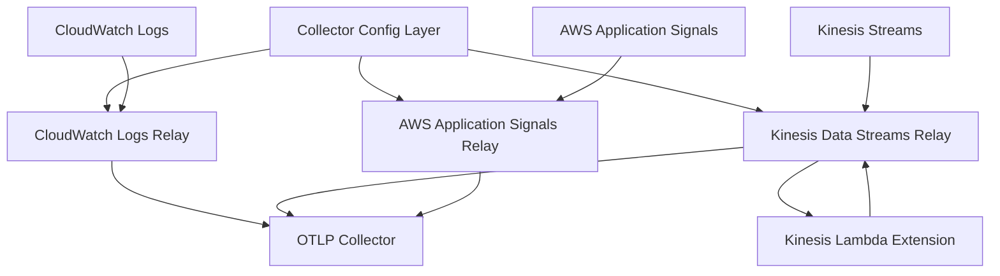

# Rearset OTLP Forwarder Pipeline

A comprehensive OpenTelemetry (OTLP) forwarding infrastructure deployed using [samstacks](https://dev7a.github.io/samstacks/) - a pipeline orchestration tool for AWS SAM stacks.

## Overview

The Rearset pipeline deploys a modular OTLP forwarding system that collects telemetry data from various sources and forwards it to OpenTelemetry collectors. The infrastructure supports multiple transport mechanisms and can be configured for different deployment scenarios.

## Architecture



## Components

### Core Infrastructure
- **Collector Config** - Centralized configuration layer for all OTLP collectors
- **CloudWatch Logs Relay** - Processes logs containing OTLP stdout spans

### Optional Components (Configurable)
- **Kinesis Data Streams Relay** - High-throughput stream processing for OTLP data
- **Kinesis Lambda Extension** - Extension that sends OTLP data to Kinesis streams
- **AWS Application Signals Relay** - Processes native AWS Application Signals spans

## Prerequisites

- **Python 3.8+** with [uvx](https://github.com/astral-sh/uv) installed
- **AWS CLI** configured with appropriate permissions
- **SAM CLI** for template validation and deployment
- **Appropriate AWS permissions** for deploying Lambda functions, IAM roles, and other resources

## Quick Start

### 1. Deploy with Default Configuration

```bash
# Deploy the full pipeline with default settings
uvx samstacks deploy pipeline.yaml
```

### 2. Deploy with Custom Configuration

```bash
# Deploy with custom inputs
uvx samstacks deploy pipeline.yaml \
  --input enable_kinesis_relay=false \
  --input enable_signals_relay=true \
  --input collector_extension_arn=arn:aws:lambda:us-east-1:123456789012:layer:my-collector:1
```

### 3. Deploy with Environment Variables

```bash
# Set environment-specific configuration
export ROUTE_ALL_LOGS=true
export VPC_ID=vpc-12345678
export SUBNET_IDS=subnet-12345678,subnet-87654321
export KINESIS_STREAM_MODE=ON_DEMAND

uvx samstacks deploy pipeline.yaml
```

## Configuration Options

### Pipeline Inputs

| Input | Type | Default | Description |
|-------|------|---------|-------------|
| `collector_extension_arn` | string | Public AWS layer ARN | ARN of the OTLP collector extension layer |
| `enable_kinesis_relay` | boolean | `true` | Enable Kinesis Data Streams transport |
| `enable_signals_relay` | boolean | `true` | Enable AWS Application Signals processing |

### Environment Variables

| Variable | Default | Description |
|----------|---------|-------------|
| `ROUTE_ALL_LOGS` | `true` | Route all AWS logs to the processor |
| `VPC_ID` | - | VPC ID for VPC deployment (optional) |
| `SUBNET_IDS` | - | Comma-separated subnet IDs for VPC deployment |
| `KINESIS_STREAM_MODE` | `PROVISIONED` | Kinesis stream mode (`PROVISIONED` or `ON_DEMAND`) |
| `KINESIS_SHARD_COUNT` | `1` | Number of shards for provisioned Kinesis streams |
| `OTEL_COLLECTOR_EXTENSION` | - | Override default collector extension ARN |

## Deployment Scenarios

### Scenario 1: Full Pipeline (Default)
Deploys all components including Kinesis and Application Signals processing.

```bash
uvx samstacks deploy pipeline.yaml
```

### Scenario 2: CloudWatch Logs Only
Deploy only CloudWatch logs processing, skipping Kinesis and Signals components.

```bash
uvx samstacks deploy pipeline.yaml \
  --input enable_kinesis_relay=false \
  --input enable_signals_relay=false
```

### Scenario 3: Production with VPC
Deploy in a VPC with custom networking configuration.

```bash
export VPC_ID=vpc-production
export SUBNET_IDS=subnet-private-1,subnet-private-2
export KINESIS_STREAM_MODE=PROVISIONED
export KINESIS_SHARD_COUNT=3

uvx samstacks deploy pipeline.yaml
```

### Scenario 4: Development Environment
Lightweight deployment for development.

```bash
export KINESIS_STREAM_MODE=ON_DEMAND
export ROUTE_ALL_LOGS=false

uvx samstacks deploy pipeline.yaml \
  --input enable_signals_relay=false
```

## Post-Deployment Configuration

### 1. Configure Collector Secrets

After deployment, you'll need to configure the collector endpoint and authentication:

```bash
# Get the secrets ARN from the deployment output
SECRETS_ARN=$(aws cloudformation describe-stacks \
  --stack-name rearset-collector \
  --query 'Stacks[0].Outputs[?OutputKey==`CollectorConfigSecretsArn`].OutputValue' \
  --output text)

# Update the secret with your collector configuration
aws secretsmanager update-secret \
  --secret-id $SECRETS_ARN \
  --secret-string '{
    "name": "Production OTLP Collector",
    "endpoint": "https://your-otel-collector.example.com",
    "auth": "Authorization=Bearer your-token,X-API-Key=your-api-key"
  }'
```

### 2. Verify Deployment

```bash
# Check deployment status
uvx samstacks validate pipeline.yaml

# Test the Kinesis extension (if deployed)
FUNCTION_URL=$(aws cloudformation describe-stacks \
  --stack-name rearset-kinesis-extension \
  --query 'Stacks[0].Outputs[?OutputKey==`ExampleFunctionUrl`].OutputValue' \
  --output text)

curl -f $FUNCTION_URL
```

## Management Commands

### Validate Configuration
```bash
# Validate the pipeline configuration
uvx samstacks validate pipeline.yaml
```

### Generate Deployment Report
```bash
# Deploy with detailed reporting
uvx samstacks deploy pipeline.yaml --report-file deployment-report.md
```

### Delete the Pipeline
```bash
# Delete all stacks in reverse order
uvx samstacks delete pipeline.yaml
```

### Debug Deployment Issues
```bash
# Deploy with verbose logging
uvx samstacks deploy pipeline.yaml --debug
```

## Stack Dependencies

The pipeline automatically manages dependencies between stacks:

1. **collector** → Deployed first (no dependencies)
2. **logs-relay** → Depends on collector outputs
3. **kinesis-relay** → Depends on collector outputs
4. **kinesis-extension** → Depends on kinesis-relay outputs
5. **signals-relay** → Depends on collector outputs

## Troubleshooting

### Common Issues

**Stack deployment failed**
- Check AWS permissions for CloudFormation, Lambda, and IAM
- Verify that the collector extension ARN is accessible
- Review CloudFormation events in the AWS Console

**VPC deployment issues**
- Ensure subnets have internet access for Lambda functions
- Verify security group configurations
- Check NAT Gateway or VPC endpoints for AWS service access

**Kinesis stream errors**
- Verify Kinesis service limits in your region
- Check IAM permissions for Kinesis operations
- Ensure sufficient shard capacity for your workload

### Getting Help

- Review the [samstacks documentation](https://dev7a.github.io/samstacks/)
- Check [AWS SAM troubleshooting guides](https://docs.aws.amazon.com/serverless-application-model/latest/developerguide/serverless-sam-cli-troubleshooting.html)
- Examine CloudFormation stack events in the AWS Console

## Related Documentation

- [Collector Configuration](collector/README.md)
- [CloudWatch Logs Processor](otlp-stdout-logs-processor/README.md)
- [Kinesis Processor](experimental/otlp-stdout-kinesis-processor/README.md)
- [AWS Application Signals Processor](experimental/aws-span-processor/README.md) 