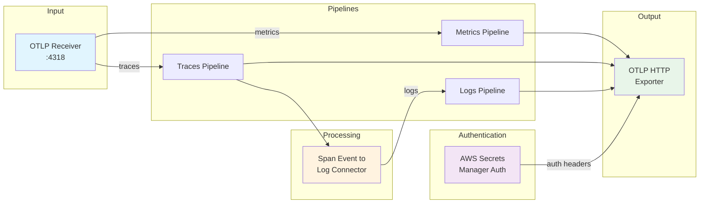

# OpenTelemetry Collector Configuration

This directory contains the OpenTelemetry Collector configuration layer used by the Rearset pipeline to process and forward telemetry data.

## Overview

The collector configuration implements a sophisticated telemetry processing pipeline that:
- Receives traces, metrics, and logs via OTLP
- Authenticates outgoing requests using AWS Secrets Manager
- Converts span events into structured log records
- Forwards all telemetry data to a configured endpoint

## Architecture



## Configuration Components

### Extensions

#### AWS Secrets Manager Authenticator ([asmauthextension](https://github.com/dev7a/otelcol-ext-asmauth))

Manages authentication headers for outgoing HTTP requests using credentials stored in AWS Secrets Manager.

```yaml
extensions:
  asmauthextension/default:
    secret_name: rearset-collector/configmap/secrets
    region: "us-east-1"
    header_key: auth
```

**Configuration:**
- `secret_name`: The AWS Secrets Manager secret containing authentication headers
- `region`: AWS region where the secret is stored
- `header_key`: The key in the secret containing headers in `key=value,key2=value2` format

### Receivers

#### OTLP Receiver

Accepts telemetry data in OpenTelemetry Protocol format over HTTP.

```yaml
receivers:
  otlp:
    protocols:
      http:  # Default port: 4318
```

### Exporters

#### OTLP HTTP Exporter

Forwards telemetry data to the configured endpoint with authentication.

```yaml
exporters:
  otlphttp/default:
    endpoint: "${secretsmanager:rearset-collector/configmap/secrets#endpoint}"
    auth:
      authenticator: asmauthextension/default
```

**Features:**
- Dynamic endpoint configuration from AWS Secrets Manager
- Automatic authentication header injection
- Support for all telemetry signals (traces, metrics, logs)

### Connectors

#### Span Event to Log Connector ([spaneventtolog](https://github.com/dev7a/otelcol-con-spaneventtolog))

Extracts events from spans and converts them into structured log records.

```yaml
connectors:
  spaneventtolog:
    include_span_context: true
    add_level: true
    log_attributes_from: 
      - event.attributes 
      - resource.attributes
```

**Configuration:**
- `include_span_context`: Adds trace context (trace_id, span_id) to log records
- `add_level`: Extracts severity level from span events
- `log_attributes_from`: Sources for additional log attributes

## Pipeline Configuration

### Traces Pipeline

```yaml
traces:
  receivers: 
    - otlp
  exporters: 
    - otlphttp/default
    - spaneventtolog
```

Receives traces via OTLP, forwards them to the configured endpoint, and extracts span events for the logs pipeline.

### Logs Pipeline

```yaml
logs:
  receivers: 
    - spaneventtolog
  exporters: 
    - otlphttp/default
```

Receives logs from the span event connector and forwards them to the configured endpoint.

### Metrics Pipeline

```yaml
metrics:
  receivers:
    - otlp
  exporters:
    - otlphttp/default
```

Simple pass-through for metrics from OTLP receiver to exporter.

## Secrets Configuration

The collector expects a secret in AWS Secrets Manager with the following structure:

```json
{
  "name": "Production OTLP Collector",
  "endpoint": "https://your-otel-collector.example.com",
  "auth": "Authorization=Bearer your-token,X-API-Key=your-api-key"
}
```

**Secret Fields:**
- `name`: Friendly name for the collector (informational)
- `endpoint`: The OTLP endpoint URL
- `auth`: Comma-separated list of headers in `key=value` format

### Creating the Secret

```bash
aws secretsmanager create-secret \
  --name rearset-collector/configmap/secrets \
  --region us-east-1 \
  --secret-string '{
    "name": "My OTLP Backend",
    "endpoint": "https://otlp.example.com:4318",
    "auth": "api-key=abc123,x-tenant-id=tenant1"
  }'
```

### Updating the Secret

```bash
aws secretsmanager update-secret \
  --secret-id rearset-collector/configmap/secrets \
  --secret-string '{
    "name": "Updated Backend",
    "endpoint": "https://new-endpoint.example.com",
    "auth": "Authorization=Bearer new-token"
  }'
```

## Telemetry Configuration

The collector self-reports its own telemetry:

```yaml
telemetry:
  resource:
    service.name: ${env:AWS_LAMBDA_FUNCTION_NAME}/collector
  metrics:
    level: normal
    readers:
      - periodic:
          exporter:
            otlp:
              protocol: http/protobuf
              endpoint: http://localhost:4318
```

This configuration:
- Sets the service name based on the Lambda function name
- Exports its own metrics via OTLP
- Uses batching for efficient log and trace export

## Deployment

This configuration is deployed as an AWS Lambda layer by the samstacks pipeline:

1. The `Makefile` copies `collector.yaml` to the artifacts directory
2. SAM packages it as a Lambda layer
3. The layer is referenced by all relay functions


## Troubleshooting

### Common Issues

**Authentication Failures**
- Verify the secret exists and has the correct format
- Check IAM permissions for accessing the secret
- Ensure the `auth` field contains valid header format

**Connection Errors**
- Verify the endpoint URL is correct and accessible
- Check security groups if running in VPC
- Ensure the Lambda function has internet access

**Missing Span Events**
- Verify spans contain events with proper attributes
- Check the `log_attributes_from` configuration
- Review CloudWatch logs for connector errors

### Debug Configuration

To enable debug logging, modify the telemetry section:

```yaml
telemetry:
  logs:
    level: debug
```

## Related Documentation

- [AWS Secrets Manager Authenticator Extension](https://github.com/dev7a/otelcol-ext-asmauth)
- [Span Event to Log Connector](https://github.com/dev7a/otelcol-con-spaneventtolog)
- [OpenTelemetry Collector Configuration](https://opentelemetry.io/docs/collector/configuration/)
- [OTLP Specification](https://opentelemetry.io/docs/specs/otlp/) 